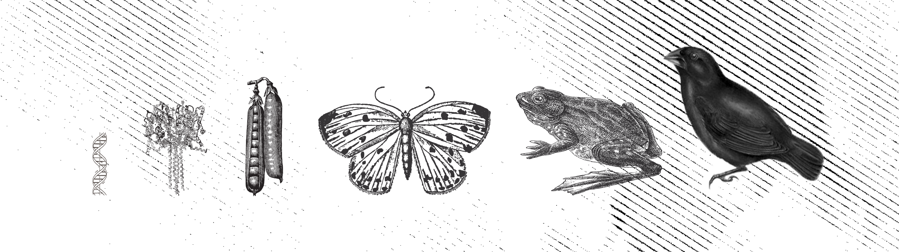

<!-- README.md is generated from README.Rmd. Please edit that file -->

```{r, include = FALSE}
knitr::opts_chunk$set(
  collapse = TRUE,
  comment = "#>"
)
```
# tidybiology meetup

<!-- badges: start -->
<!-- badges: end -->

This is a repository for the tidybiology meetup beginning January 2020. The goals of tidybiology meetups are to continue learning R and to elevate data literacy among biologists. We meet on the last Monday of each month from 4-5pm in the Winn Conference Room at the DMPI in Durham. All are welcome here.

| Date  | Topic | Code | Recording |
| ------------- | ------------- | --- | --- |
| January 2020 | Building a volcano plot from non-targeted metabolomic data | [LINK](2020_01/code) | [Video](https://www.youtube.com/watch?v=wkwFcDkbn28) |
| February 2020 | Building visualizations from pharmacology data | [LINK](2020_02/code) |
